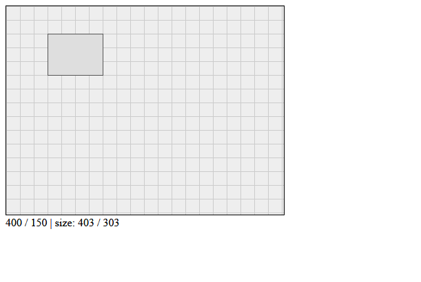

# canvas-area

## What is it ... ?

`canvas-area` is a lightweight custom html element as a controller parent for one or more canvas elements.
It allows *zoom*, *pan* and *resize* interactions.

## Show me ...



## Where is the markup code ...

```html
<canvas-area id="ca" width="401" height="301" resizable="both">
    <canvas id="c"></canvas>
</canvas-area>
```

### Attributes

* `width`: width of element in `px`.
* `height`: height of element in `px`.
* `resizable`: one of [`'none'`, `'horizontal'`, `'vertical'`, `'both'`].
* `cartesian`: `true` or `false`


## Show me the scripting API ...

`canvas-area` behaves as a standard html element with known DOM properties and methods. Additionally it offers properties ...

| Property | Type | Value | Default |
|:---|:---:|:---|:---:|
|`width`|Number| width of element in `px`| `300 px` |
|`height`|Number| height of element in `px`| `150 px` |
|`resizable`|String| one of [`'none'`, `'horizontal'`, `'vertical'`, `'both'`]| `'none'`|
|`cursor`|String| simple interface to CSS cursor attribute. | `'auto'` |
|`view`|`{x,y,scl}`| origin location `x,y` in `px` and scaling factor `scl` | `{0,0,1}` |
|`cartesian`|Boolean| `true`: `y`-axis pointing up, <br>`false`: `y`-axis pointing down  | `false` |

... methods ...

| Method | Arguments | Comment |
|:---|:---|:---|:---:|
|`pan({dx,dy})`|`dx`: delta x<br>`dy`: delta y | origin displacement. Modifies `view` property |
|`zoom({x,y,scl})`|`x`: x-center<br>`y`: y-center<br>`scl`: factor | zoom about point `{x,y}` by factor `scl`. Modifies  `view` property  |
|`resize({width,height})`|--| set element dimensions in `px`| `'none'`|
|`notify(key,value)`|`key`:&nbsp;event&nbsp;type<br>`value`:&nbsp;event&nbsp;data| notify observers of event type `key` about event `value` |
|`observe(key,handler)`|`key`:&nbsp;event&nbsp;type<br>`handler`:&nbsp;event&nbsp;handler| `{0,0,1}` |

... and events, which can be observed via `observe` method.


| Type | Object | Value |
|:---|:---:|:---|
|`'pointer'`|`{x,y,...}`| User has moved the pointer. |
|`'drag'`|`{x,y,...}`| User has moved the pointer with left button down. |
|`'resize'`|`{width,height}`| User did resize `canvas-area` element |
